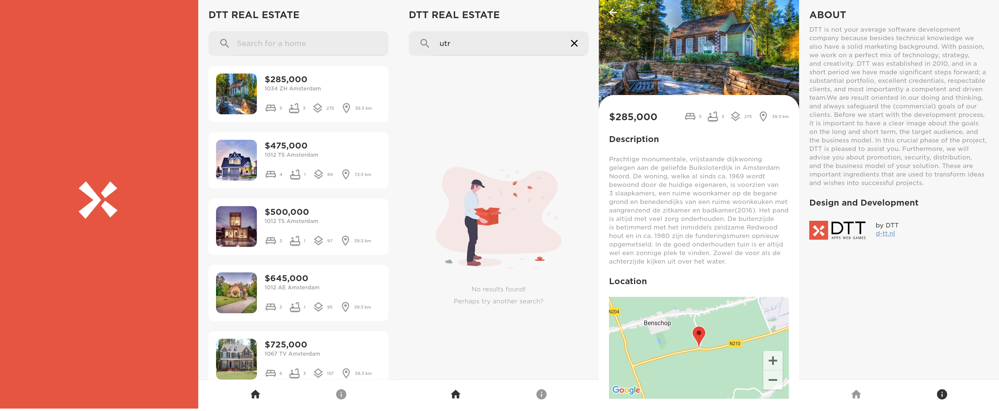

MVP app for DTT assessment. Demo.

Main functionalities:
- **Sort**: App lists the houses ordered by price (cheapest first).
- **Location**: App authorises access to location, in order to be informed how far each house is from user's current location.
- **Search**: App searches through the list of houses via the city name and/or postal code.
- **Cache**: App caches the list of houses taken from API in local database for quicker access and search can be handled with a database query.
- **Navigation**: App gives directions to a house by tapping on the map component to navigate to the property using the Google Maps app.
- **Dark mode**: App supports Dark mode 

## Requirements

- Min SDK 21+

## Tools

- Kotlin
- Retrofit
- Dagger 2
- RxJava
- Room
- Google Maps
- MVVM
- Single activity architecture (custom navigation)
- Many design patterns were used such as Dependency Injection, Repository, Singleton, Adapter, Factory, Builder, Facade etc.
